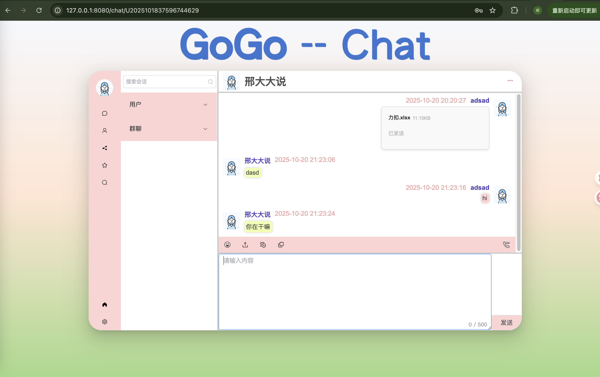
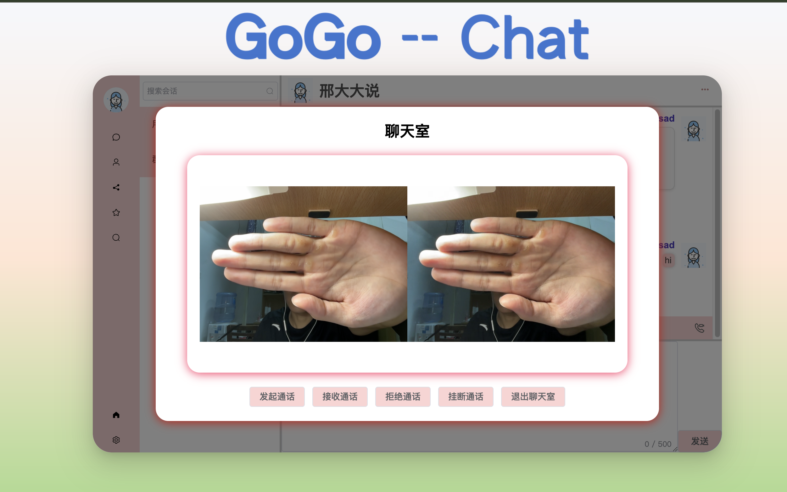

# gogochat
一个基于 Go 语言开发的即时通讯系统，支持 WebSocket 实时通信，包含单聊、群聊等基础聊天功能，并可通过配置切换切换使用内存通道或 Kafka 进行消息处理。

## 核心功能
* 用户管理：支持用户注册、登录、注销、信息查询，以及联系人的添加、删除、查询和拉黑等操作
* 实时通信：
    * 单聊功能：一对一实时消息交互
    * 群聊功能：多用户群组聊天支持
* 多消息类型：文本消息、文件、图片、视频等多种格式消息传输
* 安全通信：支持 HTTPS 加密传输，保障数据安全
* 消息处理模式：可切换 Channel 模式（内存通道）或 Kafka 模式（分布式消息队列）
* 心跳机制：实时检测客户端连接状态，清理无效连接
* 微服务架构：按功能拆分服务（用户服务、聊天服务、消息服务等），独立部署和扩展

## 技术栈
* 开发语言：Go 1.24+
* Web 框架：Gin
* 实时通信：Gorilla WebSocket
* 微服务通信：gRPC
* 网关： traefik
* 数据库：MySQL 8.0+
* 缓存：Redis 6.0+
* 消息队列：Kafka 7.0+
* 服务注册与发现：Etcd
* 部署：Docker 

## Todolist
* AI 聊天机器人：集成智能对话能力，为用户提供智能回复
* 分布式部署：支持多节点部署及负载均衡，提高系统的可扩展性和容错性
* 更多消息互动功能：消息撤回、已读回执、历史消息同步优化等，提升用户体验

## 部署
* 环境要求：
    * Docker 20.10+
    * Docker Compose 1.29+
* 部署步骤：
    1. 克隆项目代码：`git clone https://github.com/yourusername/gogochat.git`
    2. 进入项目目录：`cd gogochat`

* 访问地址：
    * Web 客户端：`http://localhost:8080`
    * gRPC 服务端：`localhost:50051`

## 运行截图
### 聊天

 

### 视频通话

## 技术选型
1. 为什么选择 Etcd 作为服务注册与发现工具？
* 强一致性：基于 Raft 算法实现分布式一致性，确保服务注册信息在集群中同步可靠，适合微服务架构中服务节点动态变化的场景。
* 高可用：支持集群部署，自动选举 leader，容忍节点故障，保障服务发现的稳定性。
* Go 生态亲和性：Etcd 由 Go 语言开发，与项目技术栈（Go）无缝集成，客户端库成熟且性能优异。
* 对比其他方案：
    * 相比 Consul：Etcd 在写操作性能和一致性保障上更优，适合对服务状态实时性要求高的场景。
    * 相比 ZooKeeper：API 更简洁，部署和维护成本更低，且更贴合云原生环境。
 

2. 为什么选择 WebSocket 作为实时通信协议？
* 全双工通信：WebSocket 建立一次连接后可实现客户端与服务端双向实时通信，避免 HTTP 轮询 / 长轮询的频繁连接开销。
* 低延迟：相比 HTTP 协议，WebSocket 减少了每次通信的头部数据，且无需重复握手，适合即时通讯场景的低延迟需求。
* 标准化支持：所有主流浏览器和服务器均原生支持，兼容性好，开发成本低。
 

3. 为什么选择 Kafka 作为消息队列？而不是 RabbitMQ/RocketMQ?
* 高吞吐量：Kafka 采用分区存储和批量处理机制，写入性能远超 RabbitMQ，适合即时通讯中高并发消息场景
* 支持持久化可靠性：消息持久化到磁盘且支持多副本，确保消息不丢失，满足聊天记录存储需求。
* 支持水平扩展：通过增加分区和 broker 节点可线性提升吞吐量，适配系统从单节点到分布式的扩展。
> 重要的一点是，主流、成熟，本人比较熟😁

4. gRPC 
* 原理：基于 HTTP/2 协议，使用 Protocol Buffers 作为序列化格式，支持双向流、多路复用和头部压缩，大幅提升跨服务通信效率。
选型理由：
* 高性能：二进制序列化（Protocol Buffers）比 JSON 更紧凑，传输效率更高；HTTP/2 多路复用减少连接开销。
* 强类型接口：通过 .proto 文件定义服务接口，生成强类型客户端 / 服务端代码，减少通信错误。
* 微服务适配：适合服务间频繁调用的场景（如用户服务与聊天服务交互），降低通信延迟。
