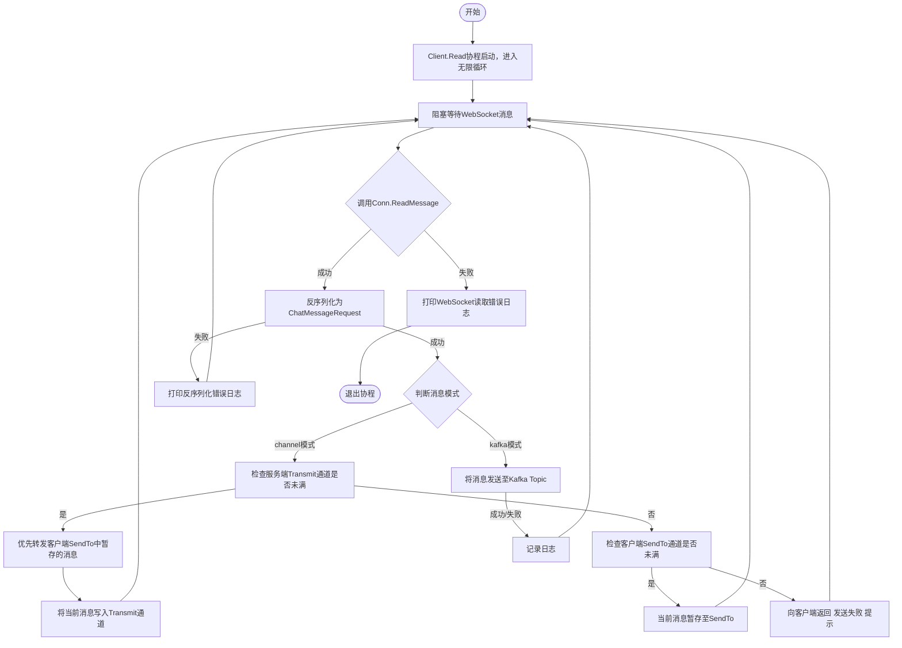

chat

```mermaid
flowchart TD
    start([开始]) --> init[Client.Read协程启动，进入无限循环]
    init --> wait[阻塞等待WebSocket消息]
    wait --> read{调用Conn.ReadMessage}
    
    read -->|成功| unmarshal[反序列化为ChatMessageRequest]
    unmarshal -->|成功| checkMode{判断消息模式}
    
    checkMode -->|channel模式| checkTransmit[检查服务端Transmit通道是否未满]
    checkTransmit -->|是| flushSendTo[优先转发客户端SendTo中暂存的消息]
    flushSendTo --> sendCurrent[将当前消息写入Transmit通道]
    sendCurrent --> wait
    
    checkTransmit -->|否| checkSendTo[检查客户端SendTo通道是否未满]
    checkSendTo -->|是| saveToSendTo[当前消息暂存至SendTo]
    saveToSendTo --> wait
    checkSendTo -->|否| sendFail[向客户端返回 发送失败 提示]
    sendFail --> wait
    
    checkMode -->|kafka模式| sendKafka[将消息发送至Kafka Topic]
    sendKafka -->|成功/失败| logKafka[记录日志]
    logKafka --> wait
    
    unmarshal -->|失败| logError1[打印反序列化错误日志]
    logError1 --> wait
    
    read -->|失败| logError2[打印WebSocket读取错误日志]
    logError2 --> exit([退出协程])
```

kafka-topics --create --bootstrap-server localhost:9092  --topic chat_message --partitions 1 --replication-factor 1